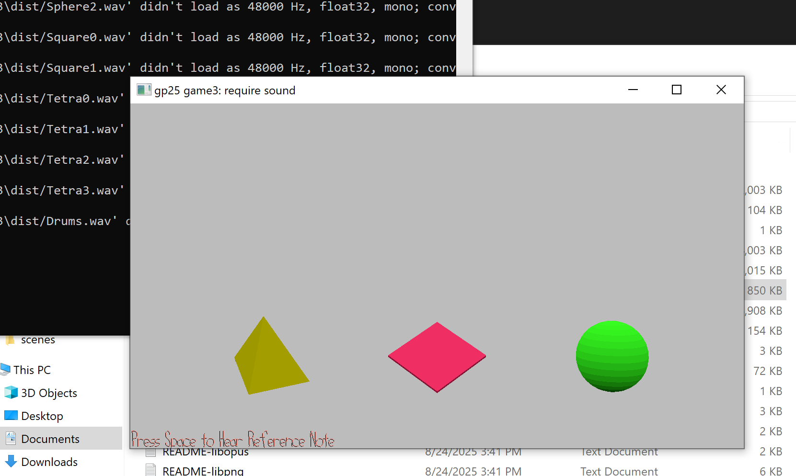

# Conducting in C

Author: Johnny Zhang

Design: This game is like a sonic tower of hanoi where the end goal is to have all three musicians play in C, the original key of the piece.

Screen Shot:

How To Play:

The player could either button mash until the right combination is achieved or try to pay attention and see which player is playing out of key.

This game was built with [NEST](NEST.md).
